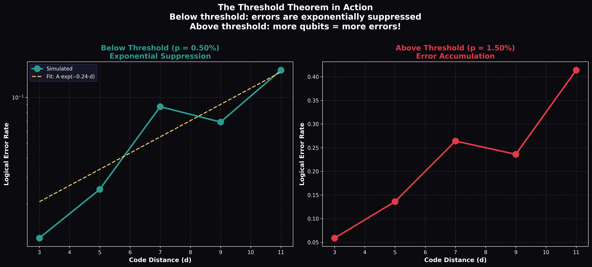
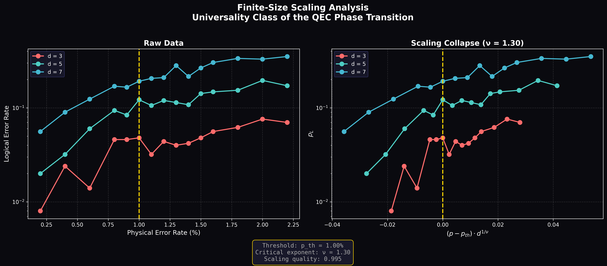

# Quantum Error Correction Threshold Simulator

A Python package for simulating and analyzing quantum error correction thresholds, with focus on the Surface Code.

## Overview

This package provides tools to:
- Simulate the rotated Surface Code with configurable distance
- Apply various noise models (depolarizing, biased, correlated)
- Decode errors using the MWPM algorithm
- Estimate error correction thresholds via Monte Carlo simulation
- Perform finite-size scaling analysis
- Generate publication-quality visualizations

## Scientific Background

The **threshold theorem** states that if the physical error rate is below a critical threshold, quantum error correction can suppress logical errors to arbitrarily low levels by increasing the code distance.

For the surface code with depolarizing noise:
- Threshold: ~1% (Fowler et al., 2012)
- Below threshold: logical error rate scales as exp(-αd)
- Above threshold: error correction fails

## Output

**Simulation Results (Distance 3-11, 1000 trials):**
- **Estimated Threshold:** $p_{th} \approx 1.00\%$
- **Confidence Interval:** $0.99\% - 1.01\%$
- **Computation Time:** ~4.5s

### Threshold Plot
Error rates for different code distances. The crossing point indicates the threshold.


### Surface Code Lattice
Visualization of the d=11 lattice with Qubit/Stabilizer layout.


### Scaling Analysis
Logical error rate suppression below threshold (exponential decay).


### Finite-Size Scaling Collapse
Universal scaling behavior near the phase transition.


## Installation

```bash
# Clone the repository
git clone https://github.com/rasidi3112/qec-threshold-simulator.git
cd qec-threshold-simulator

# Install dependencies
pip install -r requirements.txt
```

## Quick Start

```python
from qec_threshold import SurfaceCode, ThresholdEstimator

# Create surface code
code = SurfaceCode(distance=5)

# Run threshold estimation
estimator = ThresholdEstimator(
    distances=[3, 5, 7],
    num_trials=1000
)
result = estimator.run_threshold_estimation()

print(f"Threshold: {result.estimated_threshold:.4f}")
```

## Usage

### Command Line

```bash
# Run simulation with default parameters
python run_simulation.py

# Specify parameters
python run_simulation.py --distances 3 5 7 9 --trials 1000 --output results/
```

### As a Library

```python
from qec_threshold import (
    SurfaceCode,
    MWPMDecoder,
    DepolarizingChannel,
    ThresholdEstimator,
    ThresholdVisualizer,
)

# Create and simulate
code = SurfaceCode(distance=5)
channel = DepolarizingChannel(error_probability=0.01)
decoder = MWPMDecoder(code)

# Apply errors and decode
import numpy as np
rng = np.random.default_rng(42)
errors = channel.apply(code.num_data_qubits, rng)
x_syndrome, z_syndrome = code.measure_syndrome(errors)
x_correction, z_correction = decoder.decode(x_syndrome, z_syndrome)
```

## Project Structure

```
qec_threshold/
├── __init__.py           # Package exports
├── core/                 # Core components
│   ├── pauli.py          # Pauli operators
│   └── surface_code.py   # Surface code implementation
├── decoders/             # Decoder algorithms
│   └── mwpm.py           # MWPM decoder
├── noise_models/         # Noise channels
│   ├── depolarizing.py   # Depolarizing channel
│   ├── biased.py         # Biased noise
│   └── correlated.py     # Correlated noise
├── analysis/             # Analysis tools
│   ├── threshold_estimator.py
│   └── finite_size_scaling.py
└── visualization/        # Plotting utilities
    ├── threshold_plots.py
    └── advanced_plots.py
```

## References

1. Fowler, A. G., et al. "Surface codes: Towards practical large-scale quantum computation." Physical Review A 86.3 (2012): 032324. [arXiv:1208.0928](https://arxiv.org/abs/1208.0928)

2. Dennis, E., et al. "Topological quantum memory." Journal of Mathematical Physics 43.9 (2002): 4452-4505.

3. Kitaev, A. Y. "Fault-tolerant quantum computation by anyons." Annals of Physics 303.1 (2003): 2-30.

## Disclaimer

This is an **educational implementation** demonstrating QEC threshold concepts. For research-grade simulations, consider using established libraries like [Stim](https://github.com/quantumlib/Stim) or [PyMatching](https://github.com/oscarhiggott/PyMatching).

## License

This is an **open source project** released under the MIT License.

You are free to use, modify, and distribute this software. See [LICENSE](LICENSE) file for details.
